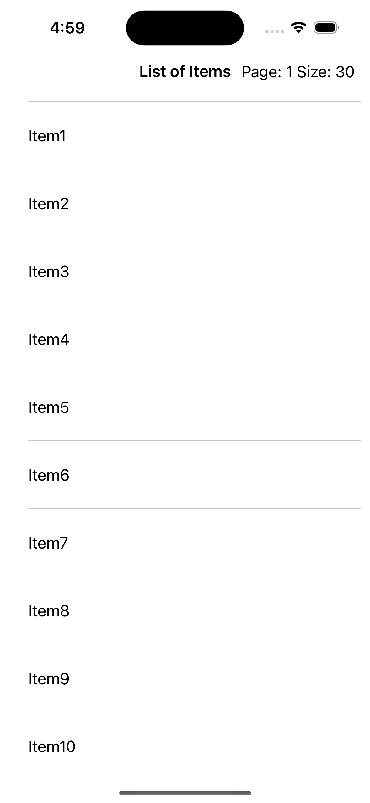
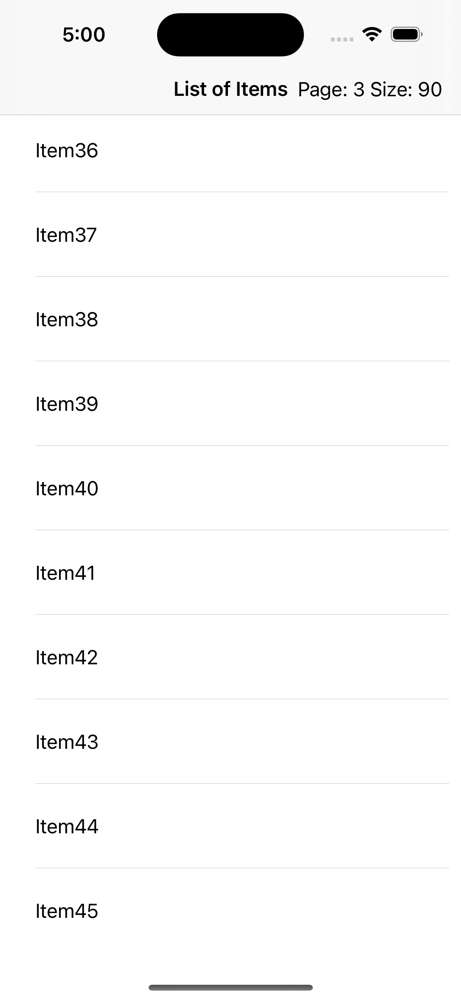

# Pagination With SwiftUI
SwiftUI위에서 Web에서 받아온 데이터를 Pagination하여 TableView에 표현.

## Screenshot
|first page|pagination|
|-|-|
|||

## 출처
- [other github-repository](https://github.com/crelies/List-Pagination-SwiftUI/blob/master/Shared/Views/ListPaginationExampleView.swift)